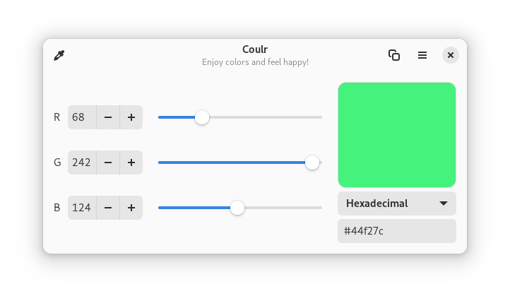

# Coulr

## Enjoy colors and feel happy

Coulr is a color box to help developers and designers. Currently, it allows to:
  - convert RGB color to its Hexadecimal value and vice versa
  - copy selected color

## Screenshots

## Installation instructions

### Universal package for Linux (recommended)

Coulr is available as a flatpak package.

You can also install it by using the following command-line:

    flatpak install flathub com.github.huluti.Coulr

### Build from source (nightly)

Build and install by running:

    git clone https://github.com/Huluti/Coulr.git
    cd Coulr
    meson _build
    cd _build
    ninja
    sudo ninja install

The app can then be removed with:

    sudo ninja uninstall

## Tech

Coulr uses open-source projects to work properly:

- [GTK 3](https://www.gtk.org)
- [Python 3](https://www.python.org)

## Donations

Do you like the app? Would you like to support its development? Feel free to donate.

## License

This project is under MIT licence... so do what you want with it :)
