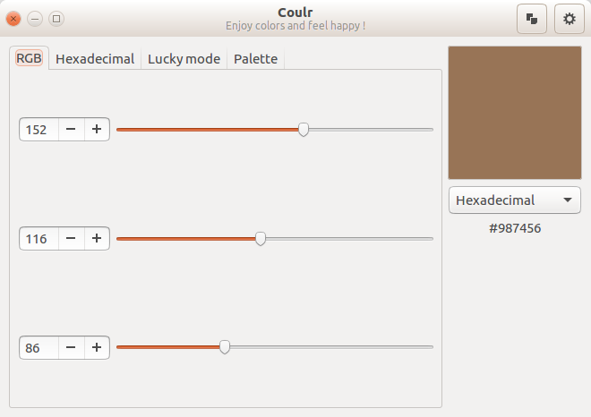

# Coulr

## Enjoy colors and feel happy

Coulr is a color box to help developers and designers. Currently, it allows to:
  - convert RGB color its Hexadeciaml value and vice versa
  - copy selected color

### Screenshots

### Version

Coulr is currently in version 0.1

### Tech

Coulr uses open-source projects to work properly:

* [Python 3](https://www.python.org/)
    * [webcolors](https://github.com/ubernostrum/webcolors)

### License

This project is under MIT licence ... so do what you want with it :)

### Help me

That would make me very happy you make me feedback on using the software.
Thanks for your interest and see you soon !
